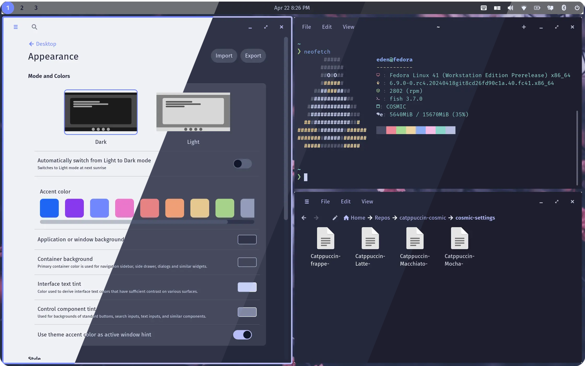
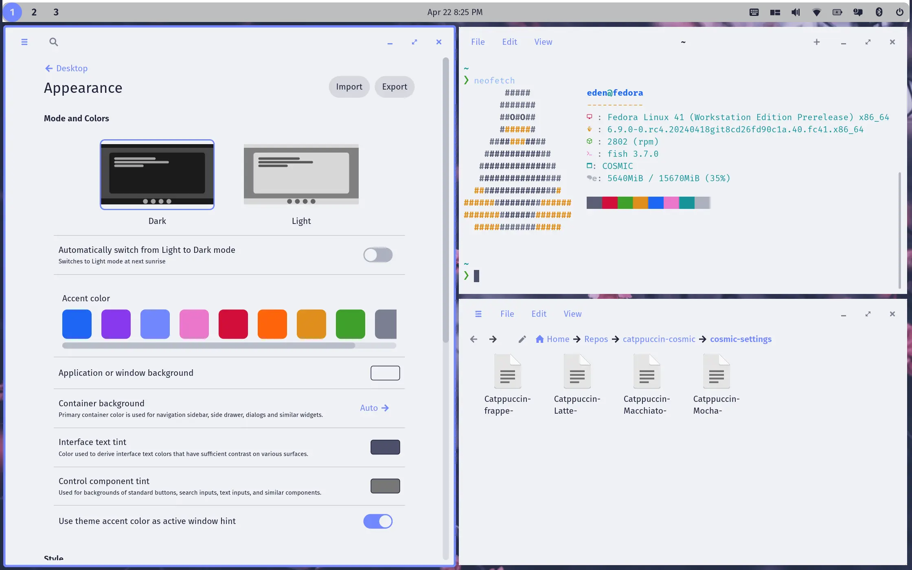
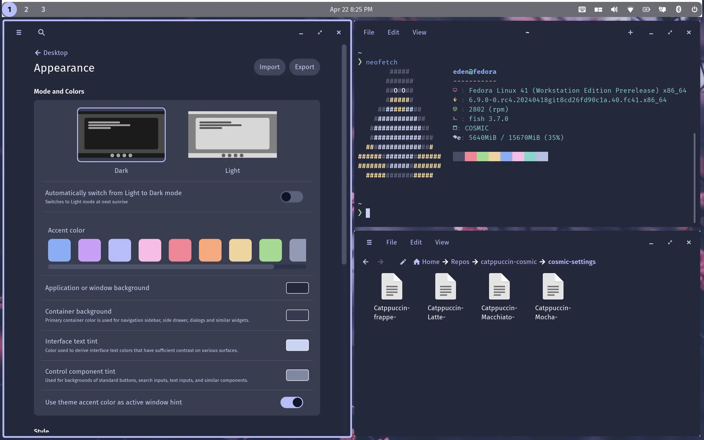

<h3 align="center">
	<br/>
	
	Catppuccin for <a href="https://github.com/pop-os/cosmic-epoch">COSMIC Desktop Environment</a>
	
</h3>

<p align="center">
	<a href="https://github.com/edenqwq/cosmic/stargazers"></a>
	<a href="https://github.com/edenqwq/cosmic/issues"></a>
	<a href="https://github.com/edenqwq/cosmic/contributors"></a>
</p>

<p align="center">
	
</p>

## Previews

<details>
<summary>🌻 Latte</summary>

</details>
<details>
<summary>🪴 Frappé</summary>

</details>
<details>
<summary>🌺 Macchiato</summary>

</details>
<details>
<summary>🌿 Mocha</summary>

</details>

## Usage

### COSMIC Desktop Appearance

1. Clone this repository locally

```bash
git clone https://github.com/EdenQwQ/cosmic.git
```

2. Open COSMIC Settings and navigate to `Desktop -> Appearance`
3. Click `Import` and browse to where you cloned this repository
4. Select the desired theme under `cosmic-settings`

### COSMIC Terminal Color Scheme

1. Clone this repository locally
2. Open COSMIC Terminal and navigate to `View -> Color schemes...`
3. Click `Import` and browse to where you cloned this repository
4. Select the desired theme under `cosmic-term`

### Generating Custom Configs

`generate.py` allows you to generate custom configs for COSMIC Desktop.
You can use this script to generate a custom config with your preferred colors and other settings.

1. To use the script, you need to have `python` and `pip` installed on your system.
2. Clone this repository locally and cd into it

```bash
git clone https://github.com/EdenQwQ/cosmic.git
cd cosmic
```

3. Create a virtual environment and install the required dependencies

```bash
python -m venv .venv
source .venv/bin/activate
pip install -r requirements.txt
```

4. Run the script with your desired options

```bash
$ python generate.py --help
usage: generate.py [-h] [--accent [accent color]]
                   [--bg-alpha [background alpha]] [--frosted frosted effect]
                   [--outer-gap [outer gap size]]
                   [--inner-gap [inner gap size]]
                   [--active-hint [active hint size]]
                   [--roundness [roundness]]
                   [--window-hint-color [window hint color]]
                   [theme flavor]

Generate a Catppuccino theme for Cosmic Desktop

positional arguments:
  theme flavor          The flavor of the theme to generate. Can be 'mocha',
                        'frappe', 'macchiato', or 'latte'.

options:
  -h, --help            show this help message and exit
  --accent [accent color], -a [accent color]
                        The accent color to use for the theme.
  --bg-alpha [background alpha], -b [background alpha]
                        The alpha value of the background color.
  --frosted frosted effect, -f frosted effect
                        Whether to use frosted glass effect for the theme.
  --outer-gap [outer gap size], -o [outer gap size]
                        The size of the outer gap.
  --inner-gap [inner gap size], -i [inner gap size]
                        The size of the inner gap.
  --active-hint [active hint size], -ah [active hint size]
                        The size of the active hint.
  --roundness [roundness], -r [roundness]
                        The roundness of the corners. Can be 'round',
                        'slightly round', or 'square'.
  --window-hint-color [window hint color], -whc [window hint color]
                        The color of the window hint.
```

## 💝 Thanks to

- [EdenQwQ](https://github.com/EdenQwQ)

&nbsp;

<p align="center">
	
</p>

<p align="center">
	Copyright &copy; 2021-present <a href="https://github.com/catppuccin" target="_blank">Catppuccin Org</a>
</p>

<p align="center">
	<a href="https://github.com/catppuccin/catppuccin/blob/main/LICENSE"></a>
</p>
